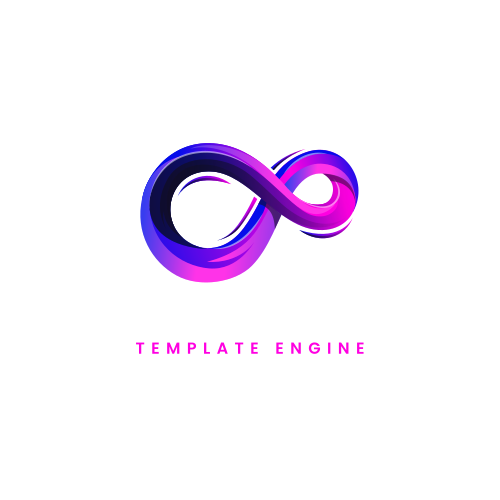

<p align="center">
    
</p>

# Tron Template Engine - VSCode Extension

A comprehensive VSCode extension for the [Tron Template Engine](https://github.com/tristanpoland/Tron_RS), providing syntax highlighting, validation, snippets, and live preview for Tron template files.

## Features

### 🎨 Syntax Highlighting
- Full syntax highlighting for Tron template files (`.tron`, `.tpl`)
- Placeholder highlighting with `@[placeholder]@` syntax
- Support for embedded Rust code syntax
- Error highlighting for malformed templates

### ✨ Intelligent Autocompletion
- Smart placeholder name suggestions
- Template snippet completion
- Context-aware completions for common patterns
- Support for `@[placeholder]@` syntax

### 🔍 Template Validation
- Real-time template validation as you type
- Placeholder naming convention checks
- Security issue detection
- Customizable validation rules

### 📋 Rich Snippet Library
- **Function templates** - `tron-fn`
- **Struct templates** - `tron-struct` 
- **Module templates** - `tron-mod`
- **API handler templates** - `tron-api`
- **Database model templates** - `tron-db`
- **Configuration templates** - `tron-config`
- **Error type templates** - `tron-error`
- **Test templates** - `tron-test`

### 🖥️ Live Preview
- Real-time template preview with sample values
- Template analysis and statistics
- Placeholder usage overview
- Auto-refresh on file changes

## Installation

### From VSCode Marketplace (Coming Soon)
1. Open VSCode
2. Go to Extensions (Ctrl+Shift+X)
3. Search for "Tron Template Engine"
4. Click Install

### Manual Installation
1. Download the `.vsix` file from releases
2. Open VSCode
3. Run `Extensions: Install from VSIX...` from the command palette
4. Select the downloaded file

### From Source
```bash
# Clone the repository
git clone https://github.com/tristanpoland/Tron_RS
cd tron_vscode

# Install dependencies
npm install

# Compile the extension
npm run compile

# Package the extension (optional)
vsce package
```

## Usage

### Creating Tron Templates

1. Create a new file with `.tron` or `.tpl` extension
2. Start typing and enjoy syntax highlighting
3. Use `Ctrl+Space` to trigger autocompletion
4. Insert snippets with prefixes like `tron-fn`, `tron-struct`, etc.

### Example Template

```rust
// Function template example
fn @[function_name]@(@[parameters]@) -> @[return_type]@ {
    @[body]@
}

// Struct template example  
#[derive(Debug, Clone)]
pub struct @[struct_name]@ {
    @[fields]@
}
```

### Using Snippets

Type any of these prefixes and press `Tab`:

- `tron-fn` → Function template
- `tron-struct` → Struct template  
- `tron-mod` → Module template
- `tron-api` → API handler template
- `tron-db` → Database model template

### Template Validation

The extension automatically validates your templates and shows:
- ❌ **Errors**: Malformed placeholders, syntax issues
- ⚠️ **Warnings**: Naming conventions, potential issues  
- ℹ️ **Info**: Style suggestions, best practices

### Live Preview

1. Open a Tron template file
2. Press `Ctrl+Shift+P` or use the command palette
3. Run "Tron: Preview Template"
4. See real-time preview with sample values

## Commands

| Command | Keybinding | Description |
|---------|------------|-------------|
| `tron.validateTemplate` | `Ctrl+Shift+T` | Validate current template |
| `tron.previewTemplate` | `Ctrl+Shift+P` | Show live preview |
| `tron.insertSnippet` | - | Insert template snippet |

## Configuration

Configure the extension through VSCode settings:

```json
{
  "tron.validation.enabled": true,
  "tron.validation.minPlaceholderLength": 2,
  "tron.preview.autoRefresh": true,
  "tron.snippets.enabled": true
}
```

### Settings Reference

| Setting | Default | Description |
|---------|---------|-------------|
| `tron.validation.enabled` | `true` | Enable template validation |
| `tron.validation.minPlaceholderLength` | `2` | Minimum placeholder name length |
| `tron.preview.autoRefresh` | `true` | Auto-refresh preview on changes |
| `tron.snippets.enabled` | `true` | Enable template snippets |

## File Associations

The extension automatically activates for:
- `.tron` files
- `.tpl` files

You can associate additional file extensions in your VSCode settings:

```json
{
  "files.associations": {
    "*.template": "tron",
    "*.tmpl": "tron"
  }
}
```

## Integration with Tron

This extension is designed to work seamlessly with the [Tron Template Engine](https://github.com/tristanpoland/Tron_RS):

```rust
use tron::{TronTemplate, TronRef};

// Load template from file
let template = TronTemplate::from_file("template.tron")?;
let mut template_ref = TronRef::new(template);

// Set placeholder values
template_ref.set("function_name", "process_data")?;
template_ref.set("parameters", "data: &[u8]")?;

// Render template
let result = template_ref.render()?;
println!("{}", result);
```

## Example Templates

### REST API Handler
```rust
/// @[description]@
pub async fn @[handler_name]@(
    Json(payload): Json<@[request_type]@>
) -> Result<Json<@[response_type]@>, StatusCode> {
    @[body]@
}
```

### Database Model  
```rust
use sqlx::FromRow;
use serde::{Serialize, Deserialize};

#[derive(Debug, Clone, Serialize, Deserialize, FromRow)]
pub struct @[model_name]@ {
    @[fields]@
}

impl @[model_name]@ {
    pub async fn find_by_id(pool: &sqlx::PgPool, id: i32) -> Result<Option<Self>, sqlx::Error> {
        @[find_query]@
    }
}
```

## Troubleshooting

### Extension Not Activating
- Ensure file has `.tron` or `.tpl` extension
- Check VSCode extension is installed and enabled
- Restart VSCode if needed

### Syntax Highlighting Issues  
- Verify file language mode is set to "Tron Template"
- Update to latest extension version
- Report issues on GitHub

### Validation Not Working
- Check `tron.validation.enabled` setting
- Ensure template has valid syntax
- Look at Output panel for error details

## Contributing

We welcome contributions! See the [Contributing Guide](../CONTRIBUTING.md) for details.

### Development Setup

```bash
git clone https://github.com/tristanpoland/Tron_RS
cd tron_vscode
npm install
code .
```

Press `F5` to launch a new Extension Development Host window for testing.

### Building

```bash
npm run compile        # Compile TypeScript
npm run watch         # Watch mode for development  
vsce package         # Create .vsix package
```

## Changelog

### 1.0.0
- Initial release
- Syntax highlighting for Tron templates
- Template validation and linting
- Rich snippet library
- Live preview functionality
- IntelliSense and autocompletion

## License

This extension is licensed under the MIT License. See [LICENSE](../LICENSE) for details.

## Links

- [Tron Template Engine](https://github.com/tristanpoland/Tron_RS)
- [Documentation](https://docs.rs/tron)
- [Examples](https://github.com/tristanpoland/Tron_RS/tree/main/examples)
- [Issues](https://github.com/tristanpoland/Tron_RS/issues)

---

**Happy templating with Tron! 🔷**